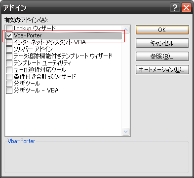
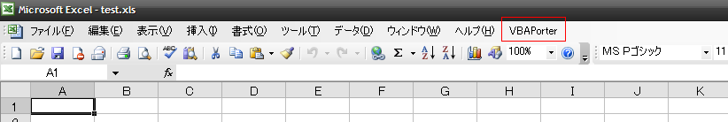

これは何？
==========

Excelのアドインです。  
Visual Basic EditorのVBAコンポーネント(標準モジュール/クラスモジュール/フォームモジュール)の  
インポート/エクスポートを実施するメニューを提供します。  

本アドインによって、以下が可能になります。

* VBAをSVNなどでバージョン管理する
* VBAをVisual Basic Editor以外のエディタで開発する


特徴
====

### メニューから独自コンポーネントのインポート/エクスポート

以下のメニューで独自コンポーネントのインポート/エクスポートができます。


### メニューから独自コンポーネントの関数を実行

インポートされたコンポーネントから以下のような独自メニューが生成され、
コンポーネントの関数を実行できます。


### エクスポート先のファイル変更を検知

インポート後、あなたがVisual Basic EditorでVBA開発している時、  
他のプログラム(例えば、SVN)がエクスポート先のファイルを変更することがあるかも知れません。  
その場合には、エクスポートの際に以下のようなダイアログを表示しますので、  
該当のコンポーネントをエクスポートするかどうか選択できます。


インストール
============

1. vba-porter.xlaをダウンロードします。

2. Excelのメニューバーの'ツール - アドイン'を選択します。

3. 表示されたダイアログの参照ボタンをクリックします。

    

4. ダウンロードしたvba-porter.xlaを選択します。

    

5. 以下のようにVba-Porterが選択されていることを確認して、OKをクリックします。

    

6. ExcelのメニューバーにVBAPorterができたことを確認します。

    


設定
====

ホームディレクトリに設定ファイルを配置する必要があります。  
ファイル名は、'.vbaporter'か'_vbaporter'です。  
ファイル形式は、WindowsのINI形式です。  
以下のように、コンポーネントが存在する場所毎にセクションを定義して下さい。

```ini
[MyProj]
; セクション名は任意の文字列です。但し、セクション間でユニークにして下さい。

ROOT=D:\Work\SampleProj\src
; ROOTはコンポーネントが存在するルートディレクトリの絶対パスです。
; コンポーネントは、このディレクトリ配下から再帰的に検索されます。

MENUNAME=SampleProject
; MENUNAMEはROOT配下のコンポーネントから生成される独自メニューのルートメニュー名です。
; もし、このコンポーネントからメニューを生成しない場合は、この値は設定しないで下さい。
; 子メニューのメニュー名は、そのコンポーネントのディレクトリ名が使われます。
```

※'conf'ディレクトリにサンプルがあります。  


留意事項
========

### マクロのセキュリティ

インポート/エクスポートの実行で以下のようなエラーが表示されるかも知れません。  


その場合は、Excelのメニューバーの'ツール - マクロ - セキュリティ'で表示されるダイアログの設定を確認してみて下さい。  

* セキュリティレベルが中以下であること

    

* 信頼できる発行元が以下のようにチェックされていること

    

### インポート

インポートを実行すると、vba-porter.xlaのVBAプロジェクトのコンポーネントは一旦全て削除されます。  
Visual Basic Editorで新しいモジュールを作成したり、既存モジュールを変更したりした場合は、  
インポートの前にエクスポートしておかないと変更内容が消去されてしまいます。

### エクスポート

エクスポートするためには、ファイルの先頭にコメントでエクスポート先を絶対パスで定義する必要があります。  

```vb
'VBAPorter:ExportPath=C:\Path\To\Export
```

※'sample'ディレクトリにサンプルがあります。  

上記コメントはインポートの際に自動で作成/更新されますが、  
Visual Basic Editor上で新しいモジュールを作成した場合は、  
手動で上記コメントを定義しないと、そのモジュールはエクスポートされません。

### コンポーネント名

本アドインは複数の場所にあるコンポーネントを管理できますが、  
それらは、全てvba-porter.xlaのVBAプロジェクトのコンポーネントとしてインポートされます。  
VBAプロジェクトは名前空間がなくフラットであるため、  
コンポーネント名はインポートする全コンポーネントで一意である必要があります。  

また、vba-porter自体がmain.basという標準モジュールに定義されているため、  
main.basという標準モジュールは管理できません。

### 独自メニュー生成の条件

独自メニューを生成するためには、以下の条件を満たす必要があります。

* 'Click'という名前のPublicなSubを定義する。(メニュー押下時、この関数が実行されます)
* ファイルの先頭に、コメントでメニュー名を定義する。

```vb
'VBAPorter:MenuName=メニュー その１
Public Sub Click()
End Sub
```

※'sample'ディレクトリにサンプルがあります。  
※メニューは上記条件を満たした標準モジュールからのみ生成されます。  


動作確認
========

* Windows ... Windows XP SP3
* Excel ... Excel 2003 SP3


**Enjoy!!!**

