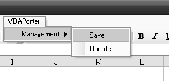
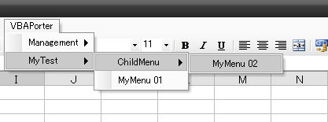
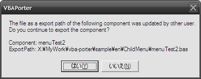
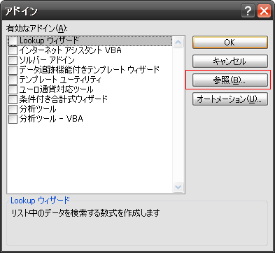
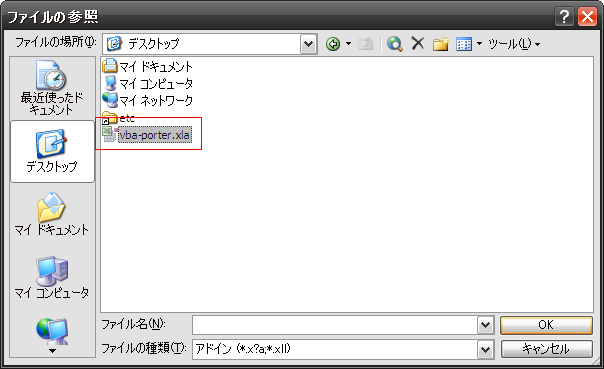
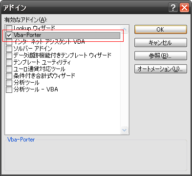
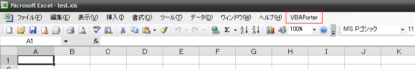

[Japanese](https://github.com/aki2o/vba-porter/blob/master/README-ja.md)

What's this?
============

This is a addin of Excel.  
This addin provides the menu which import/export/run your VBA component,
 (Standard/Class/Form module), on Visual Basic Editor.  

You can do the following by this addin.

* Doing the version management, (ex. SVN), for VBA
* Coding VBA on the editor other than Visual Basic Editor


Feature
=======

### Provide menu for importing/exporting your component

You can run importing/exporting your VBA source files from the following menu.



### Provide menu for running your procedure

You can run your component procedure from the menu like the following.  
The menu is created from the information of your component.



### Check modification of the your component export path

When you are developing VBA on Visual Basic Editor after import,  
it may happen that other program, (ex. SVN), changes the file which is a export path of the developed VBA.  
In the case, the following dialog is shown when export.  
So, you can continue/quit exporting the component.




Install
=======

1. Download vba-porter.xla

2. Select 'Tool - AddIn' on the menu bar of Excel

3. Press 'Reference' on the following dialog

    

4. Select the downloaded vba-porter.xla on the following dialog

    

5. Press 'OK' with selecting 'Vba-Porter' on the following dialog

    

6. Check 'VBAPorter' appeare on the menu bar of Excel like the following

    


Configuration
=============

You need to put a config file in your home directory.  
The file name is '.vbaporter' or '_vbaporter'.  
The file format is INI of Windows.  
Write section in the file for each of the directory, which has your component, like the following.

```ini
[MyProj]
; Section is any string which is required to be unique.

ROOT=D:\Work\SampleProj\src
; ROOT is a absolute path of the root directory which has your component.
; Your component is searched in the directory recursively.

MENUNAME=SampleProject
; MENUNAME is a root menu name of the built menu from your component in ROOT.
; If you don't want to create menu, don't set this key.
; The child menu name is named from the directory name which has the component.
```

\* For sample, see 'conf' directory.  


Consideration
=============

### Import

When import, remove all component of the project of vba-porter.xla before import.  
If you add/change module on Visual Basic Editor, you need to export them before import.

### Export

For export, you need to define the export path in the leading comment of the component.  

```vb
'VBAPorter:ExportPath=C:\Path\To\Export
```

\* For sample, see 'sample' directory.  

The above comment is created/updated automatically when import.  
But, if you add module on Visual Basic Editor, you need to define the above comment manually.

### Name of component

This addin can manage the component that is put in multiple location.  
But, They is imported into the VBA project of vba-porter.xla.  
The VBA project has not namespace. The constitution of the project is flat.  
So, you need to fulfill that the name of component is unique in the imported component.  

Also, The program of vba-porter is defined in 'main.bas'.  
So, you can not define 'main.bas'.

### Requirement for the menu of your component

You need to fulfill the following condition for creating your menu.

* Define the public procedure which is named 'Click'. (The procedure is called when press the menu)
* Define the menu name in the leading comment of the file.

```vb
'VBAPorter:MenuName=MyMenu 01
Public Sub Click()
End Sub
```

\* For sample, see 'sample' directory.  
\* The menu is created from only standard module which has the extension, 'bas'.  


Tested On
=========

* Windows ... Windows XP SP3
* Excel ... Excel 2003 SP3


**Enjoy!!!**

