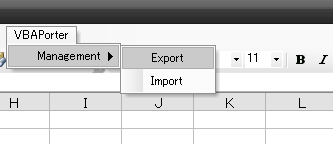

[Japanese](https://github.com/aki2o/vba-porter/blob/master/README-ja.md)

What's this?
============

This is a addin of Excel.  
The addin provides the menu which import/export/run your VBA component on Excel.


Feature
=======

### Provide menu for importing/exporting your component

You can run importing/exporting your VBA source files from the following menu.



### Provide menu for running your procedure

You can run your component procedure from the menu like the following.  
The menu is created from the information of your component.


#### Requirement for the menu of your component

You need to fulfill the following condition for creating your menu.

* Define the public procedure which is named 'Click'
* Write the menu name in the leading comment of the file

```vb
'VBAPorter:MenuName=MyMenu 01
Public Sub Click()
End Sub
```

\* For detail, see 'sample' directory.  
\* The menu is created from only standard module which has the extension, 'bas'.

### Check modification of the file which is a export path of your component

When you are developing VBA on Visual Basic Editor,  
it may happen that other program changes the file which is a export path of the developed VBA.  
In the case, the following dialog is shown and you can continue/quit exporting the component.


Install
=======

1. Download vba-porter.xla

2. Select Tool - AddIn on the menu bar of Excel

3. Press 'Reference' on the following dialog


4. Select the downloaded vba-porter.xla on the following dialog


5. Press 'OK' with selecting 'Vba-Porter' on the following dialog


6. Check 'VBAPorter' is appeared on the menu bar of Excel like the following


Configuration
=============

You need to put a config file in your home directory.  
The file name is '.vbaporter' or '_vbaporter'.  
The file format is INI of Windows.  
Write section in the file for each of the directory, which has your component, like the following.

```ini
[MyProj]
' Section is any string which is required to be unique.

ROOT=D:\Work\SampleProj\src
' ROOT is a absolute path of the root directory which has your component.
' Your component is searched in the directory recursively.

MENUNAME=SampleProject
' MENUNAME is a root menu name of the built menu from your component in ROOT.
' If you don't want to create menu, don't set this key.
' The child menu name is named from the directory name which has the component.
```

\* For sample, see 'conf' directory.  


Tested On
=========

* Windows ... Windows XP SP3
* Excel ... Excel 2003 SP3


**Enjoy!!!**

